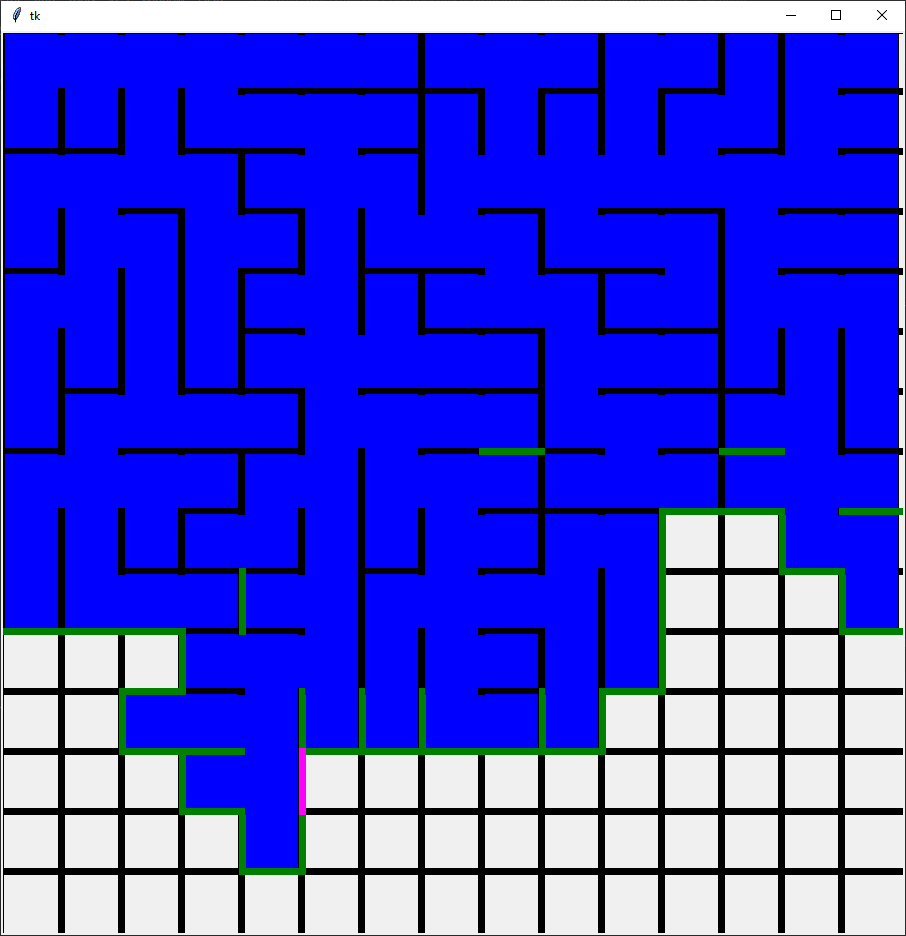

# Maze Generation
 Generating a maze with Prim's Algorithm

So one day a friend was doodling mazes in class, and gave one to me  at maze solving algorithms and how they work just out of curiosity, and stumbled across something a bit more interesting to me that I realized would be pretty fun to program up. It was maze generating algorithms, which never really crossed my mind as something that actually needed to be implemented as drawing mazes manually doesn't seem to be much fun.

So the way I implemented this was based on another algorithm called Prim's algorithm that I actually learned about in my discrete structures class at school. It takes in a simple graph with weighted edges, and spits out its "minimal spanning tree", which is just the tree which has lowest total weight that reaches every vertex within the original graph. The algorithm goes something like this:

## Prim's Algorithm
1. Pick a starting vertex, and add it to the tree
2. Consider all the edges adjacent to that vertex, and pick the one with lowest weight
3. Add that edge and the vertex it's connected to that isn't already in the tree
4. Now consider all edges (that aren't already in the tree) that are adjacent to a vertex in the tree, pick one with lowest weight to add
5. Repeat steps 4 then 3 until every vertex is added

The way to adapt this to a maze becomes almost obvious once you consider the natural connection from vertices in a tree to cells in a grid maze, and from edges to the walls of each cell.

## The Maze Algorithm
1. Pick a starting cell, add it to the maze
2. Consider all walls that surround that cell, add it to a list of "active walls"
3. Pick a wall randomly from the list of active walls. If the cells on both sides of the wall have been visited, add that wall to the maze. If not, destroy that wall to make a passageway, and consider both cells visited.
4. If a cell was added, add its walls to the list of active walls
5. Repeat steps 3 and 4 until the list of active walls is empty

Using this algorithm, these are some examples of mazes that I get.

  |  
:-------------------------:|:-------------------------:
  |  

I think they look kinda pretty.

One important point to note for why this algorithm even looked like it worked in the first place. Prim's algorithm is guaranteed to spit out the **minimal spanning tree**. If you don't know graph theory, don't worry about the details. Basically, this just ensures that not only is there a solution or path from any cell to any cell in the maze, but importantly, a unique one.

Now you might notice the biggest difference here between my algorithm and what Prim's algorithm does: there are no weights on these walls. That's why we have to approach this process a bit differently. We don't know which edge (wall) is the one we should add to our maze, so we have to just pick one randomly every time, which is actually what Prim's algorithm would end up doing in the case of a tie. So in this way, we can just consider each wall in the maze to be an edge of the same "weight". This random picking also helps each maze look different from the last. Also, I make the algorithm terminate when the list of walls is empty just because it's easier to detect when this happens versus trying to figure out the normal equivalent, which would be when every cell has been visited.

However, this did get me thinking: we still CAN put weights on these walls if we want! For example, why don't we try assigning weights not randomly, but in a specific idea in mind? This would actually be a pretty simple addition, just adding a weight variable within the wall class that is based on it's position in the maze, so I gave it a try using a simple Euclidian-esque formula that gave much larger weights to walls farther from the top-left origin.

Because edges with higher weight are more likely to be picked by definition, and edges in this example that are farther from our starting cell are given higher weight. Therefore, in general, this algorithm will "stray away" from the starting cell, with speed depending on how exactly I tune this formula. 

  |  
:-------------------------:|:-------------------------:
  |  

And finally, click on the below image for a full demonstration with normal weights. (I decided to add a depth first search solver just to make it a bit more satisfying)

